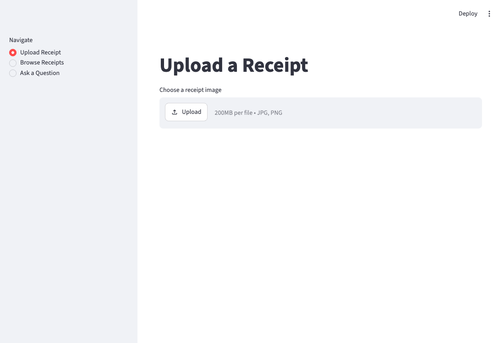

# Personal Receipt/Expense Agent



## Overview
Portfolio project for learning agentic AI skills, building on existing
experience with document processing, OCR, and API development. Takes a
receipt image, extracts structured data via OCR + LLM, stores it, and
answers natural-language questions about spending.

Full build story, including what was tried and rejected along the
way, is in [docs/dev-log.md](docs/dev-log.md) and
[docs/decisions.md](docs/decisions.md).

## Try It
```
streamlit run app.py
```
Upload a receipt, review/correct the extracted fields, browse what's
stored, and ask questions about your spending -- all in one local app.

## Goal
Transition from a backend/Java software engineer role into an agentic
AI role by building hands-on experience with:
- Tool-use agent design (agent reasoning over a small action space)
- Prompt engineering for structured data extraction
- LangChain fundamentals
- Data modeling + SQL
- API integration with LLMs

Not covered here (deferred to a second project): RAG, vector search,
multi-agent orchestration, proactive/scheduled agent behavior.

## Tech Stack
- OCR: Tesseract via pytesseract
- Parsing/reasoning: LLM API (Claude or GPT)
- Storage: SQLite (SQLAlchemy ORM, for easy future swap to Postgres)
- Agent framework: LangChain
- Interface: CLI first, Streamlit if time allows

## MVP Scope
Single receipt image -> OCR -> LLM parses to structured JSON -> store
in SQLite -> natural-language query agent answers questions over
stored data (e.g. "how much did I spend on food this month?"). The
agent decides which action to take (SQL aggregation, single lookup,
or ask for clarification) rather than following hardcoded logic —
that decision-making is the "agentic" part.

Explicitly out of scope for MVP: multiple documents/batch processing,
a real UI, RAG, multi-agent, scheduled/proactive behavior, retry
logic, validation layers, error recovery.

## Current Status
- [x] Step 1: OCR on one real receipt image, inspect raw output
- [x] Step 2: LLM parsing of OCR text into structured JSON
- [x] Step 3: Store structured record in SQLite
- [x] Step 4: Loop over a folder of multiple receipts
- [x] Step 5: Build the query agent on top of stored data
- [x] Streamlit UI over the full pipeline

See [docs/roadmap.md](docs/roadmap.md) for details and
[docs/architecture.md](docs/architecture.md) for system design.